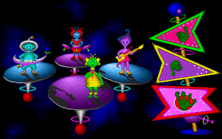

Fuzzy's World of Miniature Space Golf Decomp (in progress)
----------------------------------------------------------

This is a cool minigolf game for MS-DOS from 1995 (Pixel Painters Corporation). It requires a 386 and 4MB of RAM, but I plan to recompile for real mode 8088/8086 and 640 KB RAM, (it will probably need a 12 MHz 286 to work OK). Also I'll love to create an SDL/OpenGL port.

At the moment, only some utils were coded:
  - player.c: Plays original loudness tracker music (.DAT) in MS-DOS, and converts patterns, notes and most instrument parameters to impulse tracker (converted .it files require some tweaking and pcm samples, fixed and optimized .it conversions will be added).
  - ppext.c: Pixel painters extractor, extracts files from .RES resources.
  - convert.c: Converts.SPF and .ANI to .GIF.
  - readfile.c: Extracts ANI/SPF from RES and converts to GIF (readfile FILE.RES IMAGE.ANI).
  - readres.c: For MS-DOS, it extracts ANI/SPF from RES and displays the animation using VGA mode 13h (readres FILE.RES IMAGE.ANI).

FILE TYPES
----------

These are the files contained in the game:
  - ANI: Animation files for background, they contain a 256 color palette, 3 bytes per color (but using 6 bit VGA colors), a first frame with a complete background image, and after that, a sequence of partial images, containing only animated parts. These partial images are uncompressed in real time (confirmed), most of them are very small, contain a lot of skip commands and processing them is fast. All images are ment to be 320x200 pixels.
  - SPF: Static background images, sprite sheets and masks (for menu interactions and ball drawing), the same as ANI, but only contain the first 320x200 image. 
  - DAT: Music in LOUDNESS tracker format, it is very similar to impulse tracker, but only contains YM3812/OPL2/Adlib instruments.
  - SMP: SFX sounds, just 8 Bit, 11025Hz PCM.
  - TXT: Text data (menus, instructions...).

HOW DOES THE GAME DRAW STUFF
----------------------------

Drawing functions are optimized for VGA mode 13h, 320x200, 256 colors. The game draws everything on a RAM buffer, and then it pastes that to the 64K VRAM of mode 13h very fast (using MOVSD instruction) when the VGA is in vertical retrace mode or VSYNC.

The game first decompresses a complete 320x240 image (a logo, a background...) out of the rendering loop.
This background image is divided in two planes using the palette:
  - Colors 0-31: Plane 0.
  - Colors 32-255: Plane 1.

Then, the rest of elements are drawn in this order (probably):
  - Animated blue stars: Using the first 32 colors, they are drwan only on top of plane 0 pixels.
  - Animated foreground: Partial ANI frames which update parts of plane 1.
  - Background ships: Only ONE ship is pressent at any time, it replaces plane 0 pixels, plane 1 pixels are not modifyed, so the ship is "behind" plane 1. They probably restore plane 0 before being drawn in the next frame.
  - Ball: It is drawn on top of both planes when moving, but courses have pixel masks (in SPF files), which define where the ball is drawn and where it is not. Once the ball stops, it becomes a static part of plane 1, and it is not updated.
  - Mouse cursor: It is drawn on top of everything if the ball is not moving. When the ball moves, cursor is not drawn. It probably restores plane 0 and plane 1 before being drawn in the next frame. Also can display text info, or generate a line when ball is clicked, both the text info and the line, are drawn on top of everything, including the cursor.

NEXT STEPS
----------
  - Test if a 286 can handle the animations? => YES! (needs original ASM decoder, a bit slow in C).
  - Get animation speed and game frame rate.
  - Recreate starfield generator for pixel painters logo.
  - Recreate blue stars animations.
  - Recreate random ships movement.
  - Find game logic loop (ball physics, mouse input).  
